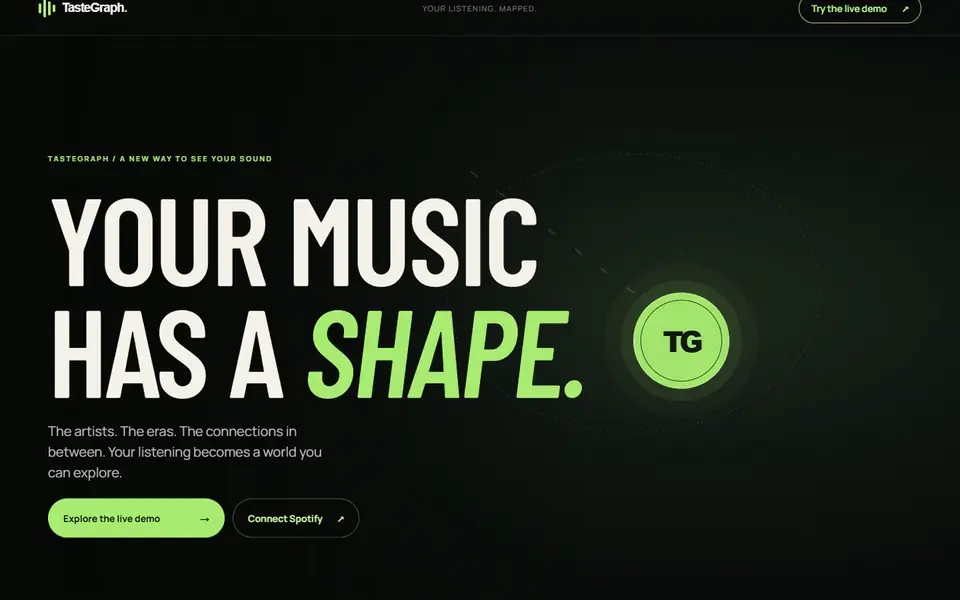

# TasteGraph

**Turns your Spotify listening history into an interactive map of your music taste.**

**[Try the live demo →](https://taste-graph-xi.vercel.app/demo)** (no sign-in needed) · [Watch the 2-minute walkthrough](docs/demo.mp4)

<a href="docs/demo.mp4"></a>

Next.js 16 · React 19 · TypeScript · Motion · Spotify Web API (OAuth 2.0 + PKCE) · Vercel

---

## What it does

Spotify tells you your top artists. TasteGraph shows you how your taste is shaped and how it's changing.

- **Artist constellation.** Your top ten artists orbit around you, sized by rank. Click one to bring it into focus.
- **Taste Drift score (0 to 100).** One number for how different your recent listening is from the rest of your year. I designed it; details below.
- **Three listening windows.** Switch between 4 weeks, 6 months, and 1 year. Every chart, ranking, and score re-animates in place.
- **Rank journey.** Trace any artist's position across all three windows.
- **Rising, steady, and fading artists,** plus how much each era overlaps with the others.

## Engineering highlights

### Secure sign-in with no database
TasteGraph stores nothing on a server. Authentication is a server-side OAuth 2.0 flow:
- **PKCE (S256)** plus a 256-bit `state` value compared in constant time, so a stolen authorization code is useless.
- **Tokens never reach JavaScript.** They live only in `httpOnly`, `Secure`, `__Host-` prefixed cookies.
- **Automatic token refresh,** including rotated refresh tokens. Invalid grants end the session; temporary Spotify outages don't.
- **Per-request nonce Content-Security-Policy,** plus HSTS, clickjacking protection, and a same-origin check on logout. Images may only load from Spotify's CDN.
- **The client secret is read only at runtime on the server.** I verified it never appears in the build output or git history.

### A metric I designed: Taste Drift
Comparing two ranked lists with plain set overlap treats your #1 artist the same as your #50. Taste Drift uses a **rank-weighted Jaccard distance** instead:
- Each artist is weighted by `1 / log2(rank + 1)`, normalized per list.
- The score is `100 × (1 − weighted similarity)`: 0 means the same ranked artists, 100 means no artists in common.

It lives in a pure, fully unit-tested module ([`src/lib/analytics.ts`](src/lib/analytics.ts)), together with the rising/steady/fading classifiers.

### A public demo that protects real data
Spotify now allows only 5 approved accounts per development app, so recruiters and visitors couldn't sign in. My solution is a `/demo` route that runs the **same dashboard code** on a snapshot of my real listening history.

A sanitizer script ([`scripts/make-demo.mjs`](scripts/make-demo.mjs)):
- strips every account identifier;
- keeps only the fields the UI renders;
- allowlists image hosts;
- **refuses to write the file** if my name, ID, photo, or profile link would survive.

Tests check that it fails safely.

### Resilient data loading
- One sign-in check, then six concurrent Spotify requests.
- If one window fails, only that section shows as unavailable, with a retry. Nothing silently appears empty.
- Rate limits pass Spotify's `Retry-After` through to the user.

### Motion and accessibility
- Built with Motion: spring physics, shared-layout transitions, scroll-linked parallax, and reveals that trigger when content is actually in view.
- Everything respects the reduced-motion setting.
- The graph is keyboard-navigable and every number is also exposed to screen readers.

## Challenges and what I'd do next

- **Spotify API changes mid-project.** In 2026 Spotify limited development apps to 5 users and stopped returning artist genres. I solved the first with the anonymized demo. The constellation originally linked artists by shared genre; my next step is to link them by collaborations on your top tracks instead.
- **Honest analytics.** Spotify's windows overlap and reflect ranking, not play counts, so the app never claims precise listening time. The full methodology is shown inside the dashboard.

## Testing

26 automated tests (Node's built-in test runner, with mocked network calls and no real credentials) cover:
- OAuth state and PKCE validation;
- the cookie security flags;
- token refresh and rotation;
- partial failures and rate limits;
- the security headers;
- the demo sanitizer;
- the analytics math.

```bash
npm test && npm run lint && npm run build
```

## Project structure

| Path | What's there |
|---|---|
| `src/app/api/auth/` | OAuth login, callback, and logout routes |
| `src/app/api/spotify/dashboard/` | Authenticated data loading and token refresh |
| `src/lib/analytics.ts` | Taste Drift and rank-movement analytics (pure functions) |
| `src/lib/spotify/` | Typed API client, config validation, cookie/session handling |
| `src/proxy.ts` | Canonical origin redirects, CSP nonces, security headers |
| `src/components/` | Dashboard, artist constellation, rank journey, motion primitives |
| `scripts/make-demo.mjs` | Snapshot sanitizer for the public demo |
| `tests/` | Auth, security, demo, and analytics tests |

<details>
<summary><strong>Run it locally</strong></summary>

1. Create an app in the [Spotify developer dashboard](https://developer.spotify.com/dashboard) with the redirect URI `http://127.0.0.1:3000/api/auth/callback`, and add your account under User Management.
2. Create `.env.local` in the project root:
   ```
   SPOTIFY_CLIENT_ID=...
   SPOTIFY_CLIENT_SECRET=...
   SPOTIFY_REDIRECT_URI=http://127.0.0.1:3000/api/auth/callback
   ```
3. Install and run:
   ```bash
   npm install
   npm run dev
   ```
4. Open http://127.0.0.1:3000 and connect Spotify.

To refresh the demo data:
1. While signed in, save `http://127.0.0.1:3000/api/spotify/dashboard` as `snapshot.raw.json` (it's gitignored).
2. Run `npm run demo:build`.
3. Delete `snapshot.raw.json`.

</details>

---

Built by [Ansh Chaudhary](https://github.com/anshc2394-beep). Uses read-only Spotify access (`user-read-private`, `user-top-read`); see the in-app [privacy page](https://taste-graph-xi.vercel.app/privacy).
